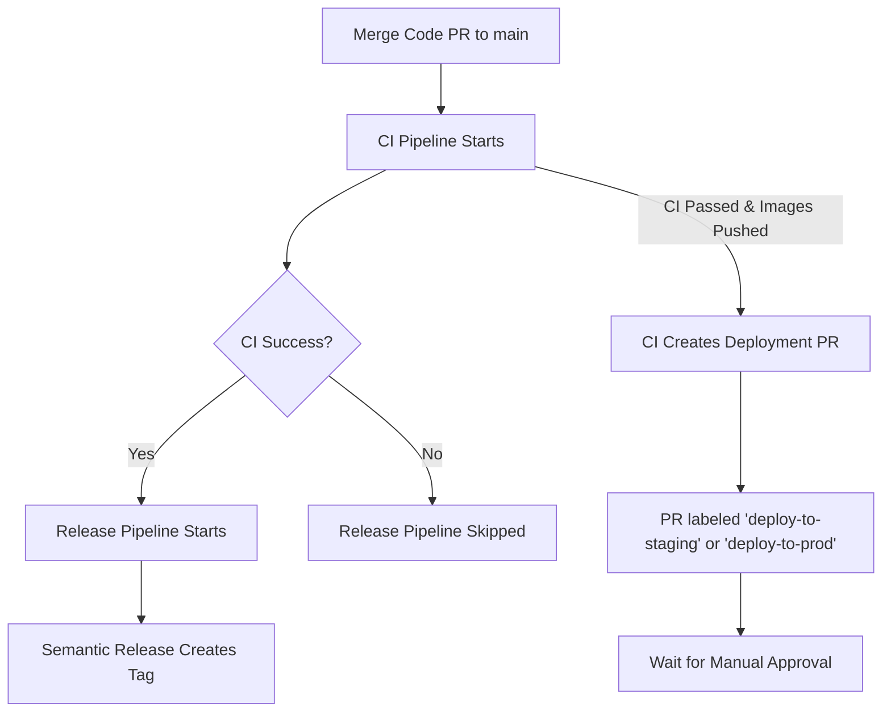
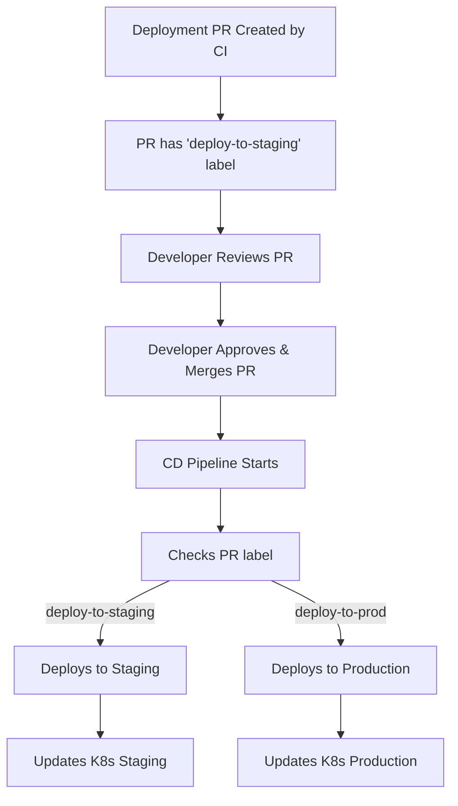

# Pipeline Execution Order & Fixes

## 🔧 Issues Fixed

### Problem: 4 Pipelines Running on Main Merge

**Before Fix:**
When you merged ANY PR to main, **4 pipelines** would trigger:
1. ✅ CI Pipeline (correct)
2. ❌ CD Pipeline (WRONG - ran on ANY PR merge)
3. ⚠️ Release Pipeline (ran in parallel with CI, not after)
4. ✅ Test Runner (correct - only on its own file changes)

**After Fix:**
Now when you merge a **code PR** to main, only **2 pipelines** run:
1. ✅ CI Pipeline
2. ✅ Release Pipeline (waits for CI to succeed)

When you merge a **deployment PR** to main, only **1 pipeline** runs:
3. ✅ CD Pipeline

---

## 📋 Pipeline Execution Flow

### Scenario 1: Regular Code PR to Main



**Execution Order:**
```
1. ✅ CI Pipeline runs (triggered by push to main)
   ├─ Builds code
   ├─ Builds Docker images
   ├─ Pushes images to GHCR
   ├─ Scans images
   └─ Creates Deployment PR (with label)

2. ✅ Release Pipeline runs (triggered by CI success)
   ├─ Waits for CI to complete successfully
   ├─ Runs semantic-release
   ├─ Creates Git tag
   └─ Updates CHANGELOG.md
```

**What triggers:** Only `push` to `main` branch

**Pipelines that run:** 2 (CI + Release)

**Time:** Sequential - Release waits for CI to finish

---

### Scenario 2: Deployment PR to Main



**Execution Order:**
```
1. ✅ CD Pipeline runs (triggered by PR merge with deployment label)
   ├─ Checks PR has 'deploy-to-staging' or 'deploy-to-prod' label
   ├─ Determines environment from label
   ├─ Verifies images exist in GHCR
   ├─ Applies K8s manifests
   ├─ Waits for deployments to be ready
   └─ Runs smoke tests
```

**What triggers:** Only PR merge to `main` with `deploy-to-staging` or `deploy-to-prod` label

**Pipelines that run:** 1 (CD only)

**Time:** Immediate on PR merge

---

## 🎯 How Each Pipeline is Triggered

### 1. CI Pipeline (`ci.yml`)

**Triggers:**
- `push` to `main` branch → Builds production images, pushes to registry
- `pull_request` to any branch → Builds alpha images, NO push to registry
- `workflow_dispatch` with `PublishBuild=true` → Builds alpha images, pushes to registry

**What it does:**
- Calculates semantic version
- Builds .NET services
- Builds frontend
- Builds Docker images
- Pushes images to GHCR (only on main or manual PublishBuild=true)
- Scans images with Trivy
- **Creates Deployment PR** (if images were pushed successfully)

**Labels it adds to Deployment PR:**
- `deployment` (always)
- `deploy-to-staging` (if no prod k8s changes) OR `deploy-to-prod` (if prod k8s changes detected)
- `automated` (always)

---

### 2. Release Pipeline (`release.yml`)

**Triggers:**
- `workflow_run` - Triggered when **CI Pipeline completes**
- Only runs on `main` branch
- **Only runs if CI completed successfully** ✅

**What it does:**
- Runs `semantic-release`
- Creates Git tags (e.g., `v1.2.1`)
- Generates release notes
- Updates CHANGELOG.md

**When it runs:**
- **After CI completes successfully**
- Sequential, not parallel
- Skipped if CI fails
- Skipped if commit contains `[skip ci]`

**Why this order matters:**
- No release is created if CI fails
- Ensures only tested code gets tagged
- Clean separation: CI tests → Release tags → CD deploys

---

### 3. CD Pipeline (`cd-staging.yml`)

**Triggers:**
- `pull_request` close to `main` **WITH specific labels** ✅
  - Must have `deploy-to-staging` OR `deploy-to-prod` label
  - Must be merged (not just closed)
- `workflow_dispatch` - Manual trigger

**What it does:**
- Determines environment from PR label
  - `deploy-to-staging` → Deploys to staging namespace
  - `deploy-to-prod` → Deploys to prod namespace
- Verifies all 7 images exist in GHCR
- Applies Kubernetes manifests
- Waits for deployments to be ready
- Runs smoke tests
- Provides deployment summary

**Protection against accidental triggers:**
```yaml
if: |
  (github.event.pull_request.merged == true && 
   (contains(github.event.pull_request.labels.*.name, 'deploy-to-staging') || 
    contains(github.event.pull_request.labels.*.name, 'deploy-to-prod'))) ||
  github.event_name == 'workflow_dispatch'
```

This ensures:
- ❌ Regular code PRs don't trigger CD
- ✅ Only deployment PRs (created by CI) trigger CD
- ✅ Manual deployment still possible via workflow_dispatch

---

### 4. Test Runner Pipeline (`test-runner.yml`)

**Triggers:**
- `workflow_dispatch` - Manual only
- `push` to `main` - Only if `.github/workflows/test-runner.yml` file changes

**What it does:**
- Tests self-hosted runner environment
- Verifies Docker, kubectl, git are installed
- Tests Kubernetes cluster access
- Confirms runner is ready for CD pipeline

**When it runs:**
- Only when you explicitly run it manually
- Only when its own configuration file changes
- **Does NOT run on regular code merges** ✅

---

## ✅ Complete Flow Example

### Example: You make a code change and merge to main

```
Step 1: Create feature branch
├─ Branch: chore/add-new-feature
└─ Make code changes

Step 2: Push to feature branch
├─ CI runs on pull_request trigger
├─ Builds alpha images (feat-add-new-feature-1.2.1-alpha.1-abc1234)
├─ Does NOT push images to registry
└─ Verifies build works

Step 3: Create PR to main
├─ CI runs again on PR update
└─ Still no push to registry

Step 4: Merge PR to main
├─ Push to main triggers CI Pipeline
├─ CI calculates version: 1.2.1
├─ CI builds production images (v1.2.1)
├─ CI pushes images to GHCR
├─ CI scans images with Trivy
└─ CI creates Deployment PR
    ├─ Branch: deploy/staging-v1.2.1-abc1234
    ├─ Title: "🚀 Deploy v1.2.1 to Staging"
    ├─ Labels: deployment, deploy-to-staging, automated
    └─ Body: Details about what's being deployed

Step 5: Release Pipeline (waits for CI)
├─ CI completes successfully
├─ Release pipeline starts automatically
├─ Creates Git tag: v1.2.1
├─ Updates CHANGELOG.md
└─ Creates GitHub Release

Step 6: Review Deployment PR
├─ Developer reviews the deployment PR
├─ Checks image versions are correct
├─ Optionally changes label to 'deploy-to-prod' if needed
└─ Approves and merges

Step 7: CD Pipeline (triggered by deployment PR merge)
├─ Detects 'deploy-to-staging' label
├─ Verifies all images exist in GHCR
├─ Applies manifests to staging namespace
├─ Waits for pods to be ready
├─ Runs smoke tests
└─ Deployment complete! ✅
```

---

## 🔑 Key Improvements

### 1. CD Pipeline Only Runs on Deployment PRs
- **Before:** CD ran on EVERY PR merge to main
- **After:** CD only runs on PRs with `deploy-to-staging` or `deploy-to-prod` label
- **Result:** No accidental deployments on code PRs

### 2. Release Runs After CI
- **Before:** Release ran in parallel with CI
- **After:** Release waits for CI to complete successfully
- **Result:** No releases created if CI fails

### 3. Proper Label-Based Deployment
- **Before:** Labels were `staging` and `production`
- **After:** Labels are `deploy-to-staging` and `deploy-to-prod`
- **Result:** Clear, explicit deployment triggers

### 4. Only 2 Pipelines on Code Merge
- **Before:** 4 pipelines ran (CI, CD, Release, Test Runner)
- **After:** 2 pipelines run (CI, then Release)
- **Result:** Faster, cleaner execution

---

## 🎯 Answer to Your Questions

### Q1: Should Release run sequentially after CI?
**Answer:** ✅ **YES** - Now implemented!
- Release pipeline now uses `workflow_run` trigger
- It waits for CI to complete
- Only runs if CI was successful
- This prevents creating releases for broken code

### Q2: When should Test Runner pipeline run?
**Answer:** ✅ **As is (manual or on self-change)** - Already correct!
- Test Runner is for testing the self-hosted runner environment
- It should only run:
  - Manually when you want to verify runner setup
  - When its own configuration changes
- It should NOT run on every code merge
- Current setup is correct ✅

---

## 📊 Pipeline Counts by Scenario

| Scenario | Pipelines That Run | Purpose |
|----------|-------------------|---------|
| Push to feature branch | 1 (CI) | Build alpha, no push |
| PR to main (open) | 1 (CI) | Verify build works |
| Merge code PR to main | 2 (CI + Release) | Build, push, tag |
| Merge deployment PR | 1 (CD) | Deploy to K8s |
| Manual test | 1 (Test Runner) | Verify runner |

---

## 🚀 What Happens Now

### When you merge a code PR to main:
```
1. CI Pipeline ✅
2. Release Pipeline ✅ (after CI succeeds)
3. CD Pipeline ❌ (not triggered - correct!)
4. Test Runner ❌ (not triggered - correct!)

Result: 2 pipelines, sequential execution
```

### When you merge a deployment PR to main:
```
1. CI Pipeline ❌ (not triggered - correct!)
2. Release Pipeline ❌ (not triggered - correct!)
3. CD Pipeline ✅ (triggered by deployment label)
4. Test Runner ❌ (not triggered - correct!)

Result: 1 pipeline, immediate deployment
```

---

## ✅ Verification Steps

To verify the fix works:

1. **Test Code PR:**
   ```bash
   git checkout -b test/pipeline-fix
   echo "test" >> README.md
   git add README.md
   git commit -m "test: verify pipeline fix"
   git push origin test/pipeline-fix
   ```
   - Create PR to main
   - Merge PR
   - **Expected:** Only CI and Release run
   - **Expected:** CI creates a deployment PR with `deploy-to-staging` label

2. **Test Deployment PR:**
   - Review the deployment PR created by CI
   - Merge the deployment PR
   - **Expected:** Only CD pipeline runs
   - **Expected:** Deploys to staging namespace

---

## 📝 Summary

✅ **CD Pipeline** - Fixed to only run on deployment PRs with specific labels
✅ **Release Pipeline** - Fixed to run sequentially after CI success
✅ **CI Pipeline** - Already correct, creates deployment PRs
✅ **Test Runner** - Already correct, manual/self-change only

**Total pipelines on code merge:** 2 (CI + Release)
**Total pipelines on deployment merge:** 1 (CD)
**Result:** Clean, predictable, no accidental deployments! 🎉
