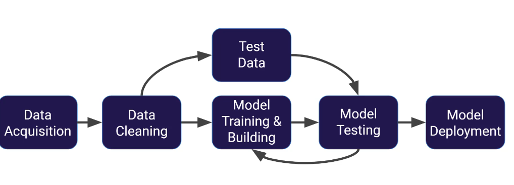

# Supervised Learning

> Supervised learning is the most common type of machine learning. This document covers what it is, how it works, the training process, and the critical concept of data splitting.

---

## Table of Contents

- [What is Supervised Learning?](#what-is-supervised-learning)
- [How Does It Work?](#how-does-it-work)
- [The Machine Learning Process](#the-machine-learning-process)
- [Train-Test Split](#train-test-split)
- [Train-Validation-Test Split (The Proper Way)](#train-validation-test-split-the-proper-way)
- [Simplified Approach (Used in Most Courses)](#simplified-approach-used-in-most-courses)
- [Key Terminology](#key-terminology)

---

## What is Supervised Learning?

**Definition:** Supervised learning algorithms are trained using **labeled examples** — that is, input data where the **desired output (label) is already known**.

The word **"supervised"** comes from the idea that the algorithm learns under the supervision of a teacher. The "teacher" is the labeled data that tells the algorithm what the correct answer is.

### The Key Ingredients

1. **Features (X):** The input data — the attributes or characteristics used to make predictions
2. **Labels (Y):** The correct output — what we're trying to predict
3. **Historical Data:** A dataset where both features and labels are already known

### Real-World Examples

| Scenario | Features (X) | Label (Y) |
|----------|-------------|-----------|
| **Spam Detection** | Email text, sender, subject line | Spam or Legitimate |
| **Movie Review Sentiment** | Review text | Positive or Negative |
| **House Price Prediction** | Square footage, bedrooms, location | Price ($) |
| **Medical Diagnosis** | Blood test results, age, symptoms | Disease Present or Not |
| **Credit Scoring** | Income, credit history, debt | Approve or Deny |

### Example Walkthrough: Spam Detection

Imagine you work at an email company and want to build a spam filter:

1. **Collect historical emails** — thousands of emails that people have already received
2. **Label them** — a human has already gone through and marked each email as either **"Spam"** or **"Legitimate"**
3. **Train a model** — feed these labeled emails into a supervised learning algorithm so it can learn the patterns (e.g., spam emails tend to have words like "free," "winner," "click here")
4. **Predict for new emails** — when a brand new email arrives, the trained model can predict whether it's spam or legitimate based on what it learned

```
Historical Emails (Labeled)          New Email (Unlabeled)
┌─────────────────────────┐          ┌──────────────────┐
│ "You won a prize!" → Spam│          │ "Meeting at 3pm" │
│ "Meeting at 2pm" → Legit │   ──►   │      ???         │
│ "Free iPhone!" → Spam    │  Model  │                  │
│ "Project update" → Legit │  says:  │   → Legitimate   │
└─────────────────────────┘          └──────────────────┘
```

---

## How Does It Work?

For neural networks specifically, the supervised learning process works like this:

1. **Input:** The network receives a set of input data (features) along with the corresponding correct outputs (labels)
2. **Prediction:** The network processes the input and produces a prediction
3. **Compare:** The algorithm compares its actual output with the correct output to find errors
4. **Adjust:** The model modifies itself accordingly — specifically by adjusting the **weights** and **bias** values in the network
5. **Repeat:** This process repeats over and over, and the model gradually gets better

```
                    ┌───────────────┐
   Features (X) ──►│               │──► Prediction (Ŷ)
                    │   MODEL       │        │
                    │               │        ▼
                    └───────────────┘   Compare with
                          ▲             True Label (Y)
                          │                  │
                          │                  ▼
                     Adjust weights    Calculate Error
                     and biases ◄──── (how wrong?)
```

> **Note:** "Weights" and "biases" are internal parameters of the neural network that get adjusted during training. Think of them as dials the model turns to improve its predictions. These will be covered in detail during neural network theory.

---

## The Machine Learning Process



Here is the **step-by-step process** for supervised learning:

### Step 1: Acquire Data

Data can come from many sources depending on your domain:
- Customer databases
- Web scraping / online APIs
- Physical sensors (IoT devices, medical equipment)
- Surveys and forms
- Public datasets (Kaggle, UCI ML Repository)

### Step 2: Clean and Format the Data

Raw data is almost never ready for a model. You need to:
- Handle **missing values** (fill them in or remove rows)
- Remove **duplicates**
- Convert **categorical data** to numbers
- **Normalize/scale** numerical features
- Remove **irrelevant columns**

> In Python, this is typically done using a library called **Pandas**.

### Step 3: Split the Data

Split your clean data into separate sets (more on this below):
- **Training Data** (~70%): Used to train the model
- **Test Data** (~30%): Used to evaluate how well the model performs on unseen data

### Step 4: Train (Fit) the Model

Use the training data to teach the model. The model looks at the features and the correct labels and learns the patterns.

### Step 5: Test the Model

Run the test data through the trained model:
- The model makes **predictions** based on the test features
- You **compare** those predictions to the actual correct labels (which you already know)

### Step 6: Evaluate Performance

Use metrics to assess how well the model did:
- For **classification**: accuracy, precision, recall, F1-score
- For **regression**: MAE, MSE, RMSE

### Step 7: Adjust and Iterate

Based on performance:
- Add more layers or neurons
- Change hyperparameters
- Try a different algorithm
- Get more data

### Step 8: Deploy

Once satisfied, deploy the model to the real world to make predictions on truly new, unseen data.

```
┌──────────┐    ┌──────────┐    ┌───────────────┐    ┌──────────┐
│ Acquire  │───►│  Clean   │───►│  Split into   │───►│  Train   │
│  Data    │    │  & Format│    │ Train / Test   │    │  Model   │
└──────────┘    └──────────┘    └───────────────┘    └────┬─────┘
                                                          │
                ┌──────────┐    ┌───────────────┐         │
                │  Deploy  │◄───│  Evaluate &   │◄────────┘
                │  Model   │    │  Adjust       │
                └──────────┘    └───────────────┘
```

---

## Train-Test Split

### Why Do We Split?

We can't test a model on the same data it was trained on — that would be like giving a student the exam answers beforehand and then testing them with the same questions. They'd get 100%, but they didn't actually learn anything.

**Splitting ensures that we test the model on data it has never seen before**, giving us a fair evaluation of its real-world performance.

### How the Split Works

```
Full Dataset (100%)
├── Training Data (70%)  →  Model learns from this
└── Test Data (30%)      →  Model is evaluated on this
```

### Example

Imagine you have 1,000 labeled emails:
- **700 emails** go into the training set → the model learns spam vs. legitimate patterns
- **300 emails** go into the test set → you feed just the email text (features) to the model, get its predictions, and compare them to the actual labels

### The Problem with a Simple Train-Test Split

Here's the issue: after testing, you might go back and tweak your model (add layers, change parameters) based on how it performed on the test data. Then you test again on the same test data.

**This is problematic** because you're effectively "leaking" information from the test set into your model-building decisions. The test set is no longer truly "unseen."

---

## Train-Validation-Test Split (The Proper Way)

To fix the problem above, especially in deep learning, data is split into **three sets**:

```
Full Dataset (100%)
├── Training Data (60%)     →  Model learns from this
├── Validation Data (20%)   →  Used to tune hyperparameters
└── Test Data (20%)         →  Final, one-time performance evaluation
```

### The Three Sets Explained

| Set | Purpose | Can You Adjust Model After? |
|-----|---------|---------------------------|
| **Training Set** | Train the model — it sees both features and labels | Yes — this is the learning phase |
| **Validation Set** | Check performance and tune hyperparameters (neurons, layers, learning rate) | Yes — go back and adjust |
| **Test Set** | Final performance evaluation — **the model's "report card"** | **No** — this is the final result |

### The Process

```
1. Train on Training Data
        │
        ▼
2. Evaluate on Validation Data
        │
        ├── Not satisfied? → Adjust hyperparameters → Go to Step 1
        │
        └── Satisfied? → Continue to Step 3
                │
                ▼
3. Final Evaluation on Test Data
        │
        ▼
4. Report this as the model's TRUE performance
   (No going back to adjust!)
```

### Why You Can't Go Back After the Test Set

Think of it this way:

- **Training data** = Practice problems with answer key
- **Validation data** = Practice exams (you can retake and study more)
- **Test data** = The **final exam** (one shot, no retakes)

If you keep going back and adjusting your model after seeing test results, you're essentially cheating — you're optimizing for that specific test set rather than truly unseen data. The performance metric you report won't reflect how the model will perform in the real world.

> **Key Rule:** Once you evaluate on the test set, that's your final performance metric. You report it as-is.

---

## Simplified Approach (Used in Most Courses)

In many courses and tutorials (including this one), we simplify to just a **train-test split** (no separate validation set):

```
Full Dataset (100%)
├── Training Data (70%)
└── Test Data (30%)
```

**Why is this acceptable for learning?**
- We're not deploying these models to the real world
- The focus is on learning the algorithms and code
- Adding a validation set is easy to do later once you understand the basics

> Once you complete the course, you'll be able to easily perform another split to get three data sets (training, validation, test) if you need to for a real-world project.

---

## Key Terminology

| Term | Definition |
|------|-----------|
| **Features (X)** | The input variables used to make predictions (e.g., email text, house square footage) |
| **Labels (Y)** | The correct output / target variable (e.g., spam/legitimate, house price) |
| **Training Data** | The portion of data used to train the model |
| **Test Data** | The portion of data used to evaluate model performance |
| **Validation Data** | An intermediate set used to tune hyperparameters before final testing |
| **Fitting / Training** | The process of the model learning patterns from training data |
| **Prediction** | The model's output when given new, unseen features |
| **Hyperparameters** | Settings you choose *before* training (e.g., number of layers, learning rate) — not learned by the model |
| **Weights & Biases** | Internal parameters the model learns *during* training |
| **Overfitting** | When a model performs great on training data but poorly on new data (it memorized rather than learned) |
| **Underfitting** | When a model is too simple to capture the underlying patterns in the data |

---

> **Next up:** [Classification Metrics](../02-Evaluation-Metrics/01-classification-metrics.md)
