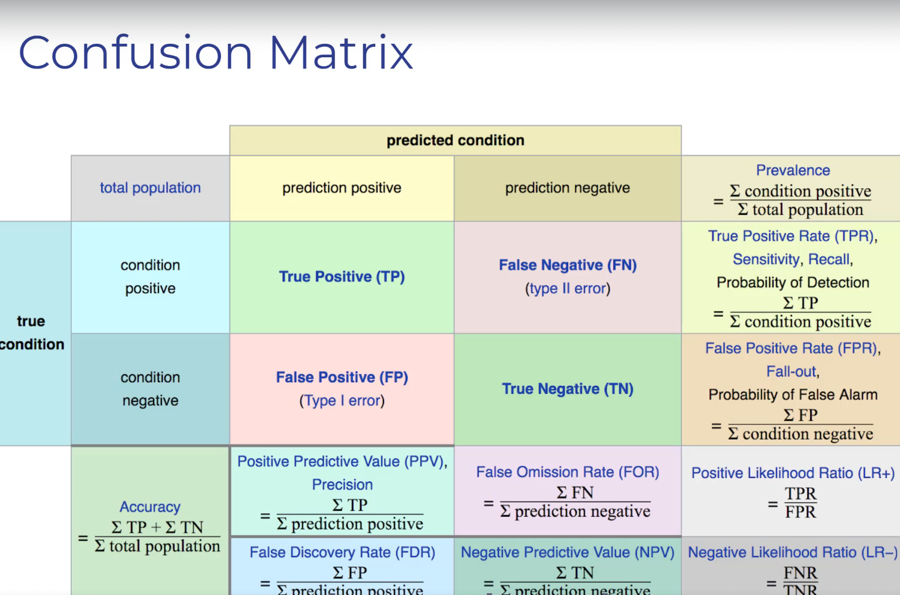

# The Confusion Matrix — A Deep Dive

> The confusion matrix is one of the most powerful tools for understanding exactly **where** your classification model is succeeding and **where** it's failing. This document walks through it with multiple examples.

---

## Table of Contents

- [What is a Confusion Matrix?](#what-is-a-confusion-matrix)
- [Structure of a Confusion Matrix](#structure-of-a-confusion-matrix)
- [Worked Example: Email Spam Detector](#worked-example-email-spam-detector)
- [Worked Example: Disease Diagnosis](#worked-example-disease-diagnosis)
- [All Metrics Derived from the Confusion Matrix](#all-metrics-derived-from-the-confusion-matrix)
- [Multi-Class Confusion Matrix](#multi-class-confusion-matrix)
- [How to Read a Confusion Matrix Quickly](#how-to-read-a-confusion-matrix-quickly)
- [Python Code Example](#python-code-example)

---

## What is a Confusion Matrix?

A confusion matrix is a **table that visualizes the performance of a classification model** by showing the counts of predictions vs. actual labels organized into four quadrants.

It answers the question: **"For each actual class, what did the model predict?"**

---

## Structure of a Confusion Matrix

Here is the complete confusion matrix with all derived metrics:



For binary classification (two classes), the matrix is a 2x2 grid:

```
                          PREDICTED
                    Positive    Negative
                 ┌────────────┬────────────┐
    ACTUAL       │    TRUE     │   FALSE    │
    Positive     │  POSITIVE   │  NEGATIVE  │
                 │    (TP)     │    (FN)    │
                 ├────────────┼────────────┤
    ACTUAL       │   FALSE     │    TRUE    │
    Negative     │  POSITIVE   │  NEGATIVE  │
                 │    (FP)     │    (TN)    │
                 └────────────┴────────────┘
```

### Reading the Matrix

- **Rows** = What the data **actually** is (ground truth)
- **Columns** = What the model **predicted**
- **Diagonal (TP + TN)** = Correct predictions ✅
- **Off-diagonal (FP + FN)** = Incorrect predictions ❌

---

## Worked Example: Email Spam Detector

### Scenario

You built a spam detector and tested it on **200 emails**. Here are the actual counts:
- 120 emails were actually **Legitimate**
- 80 emails were actually **Spam**

### The Confusion Matrix

```
                          PREDICTED
                    Spam          Legitimate
                 ┌────────────┬────────────┐
    ACTUAL       │            │            │
    Spam         │   70 (TP)  │   10 (FN)  │
    (80 total)   │            │            │
                 ├────────────┼────────────┤
    ACTUAL       │            │            │
    Legitimate   │   15 (FP)  │  105 (TN)  │
    (120 total)  │            │            │
                 └────────────┴────────────┘
```

### Breaking It Down

| Cell | Count | Meaning |
|------|-------|---------|
| **TP = 70** | 70 spam emails were correctly identified as spam | Model caught the spam ✅ |
| **TN = 105** | 105 legitimate emails were correctly identified as legitimate | Important emails stayed in inbox ✅ |
| **FP = 15** | 15 legitimate emails were wrongly marked as spam | Important emails lost in spam folder ❌ |
| **FN = 10** | 10 spam emails were wrongly marked as legitimate | Spam got through to inbox ❌ |

### Calculating Metrics

```
Accuracy  = (TP + TN) / Total = (70 + 105) / 200 = 175/200 = 87.5%

Precision = TP / (TP + FP) = 70 / (70 + 15) = 70/85 = 82.4%
  → "When the model says it's spam, it's right 82.4% of the time"

Recall    = TP / (TP + FN) = 70 / (70 + 10) = 70/80 = 87.5%
  → "The model found 87.5% of all actual spam emails"

F1-Score  = 2 × (0.824 × 0.875) / (0.824 + 0.875) = 1.442 / 1.699 = 84.9%
```

### Interpretation for Spam Detection

- **15 legitimate emails went to spam** — this could mean missing important work emails or bills. If this is a concern, we should improve **Precision**.
- **10 spam emails got through** — annoying but not critical. If this is the bigger concern, we should improve **Recall**.

---

## Worked Example: Disease Diagnosis

### Scenario

A hospital uses an ML model to screen 1,000 patients for diabetes:
- 150 patients actually have diabetes
- 850 patients are healthy

### The Confusion Matrix

```
                          PREDICTED
                  Diabetes (+)    Healthy (-)
                 ┌──────────────┬──────────────┐
    ACTUAL       │              │              │
    Diabetes     │  130 (TP)    │   20 (FN)    │
    (150 total)  │              │              │
                 ├──────────────┼──────────────┤
    ACTUAL       │              │              │
    Healthy      │   50 (FP)    │  800 (TN)    │
    (850 total)  │              │              │
                 └──────────────┴──────────────┘
```

### Breaking It Down

| Cell | What Happened | Real-World Impact |
|------|---------------|-------------------|
| **TP = 130** | 130 diabetic patients correctly identified | They get treatment. Excellent! |
| **TN = 800** | 800 healthy patients correctly cleared | They go home worry-free. Great! |
| **FP = 50** | 50 healthy patients told they might have diabetes | Unnecessary stress, additional tests needed. Inconvenient but not dangerous. |
| **FN = 20** | 20 diabetic patients told they're healthy | **DANGEROUS!** They leave without treatment. Disease progresses. |

### Calculating Metrics

```
Accuracy  = (130 + 800) / 1000 = 930/1000 = 93.0%

Precision = 130 / (130 + 50) = 130/180 = 72.2%
  → "When model says 'diabetes,' it's right 72.2% of the time"

Recall    = 130 / (130 + 20) = 130/150 = 86.7%
  → "Model caught 86.7% of all actual diabetes cases"

F1-Score  = 2 × (0.722 × 0.867) / (0.722 + 0.867) = 1.252 / 1.589 = 78.8%
```

### Which Metric Matters Most Here?

**Recall** is the most critical metric because:
- Those **20 missed patients (FN)** could suffer serious health consequences
- The **50 false alarms (FP)** are inconvenient but will be resolved with follow-up testing
- The hospital should tune the model to **maximize recall** even if precision drops somewhat

---

## All Metrics Derived from the Confusion Matrix

Every metric below can be calculated from the four building blocks: **TP, TN, FP, FN**. We'll use the **Diabetes Screening** example from above as a running reference for every formula:

```
TP = 130  |  FN = 20   |  Condition Positive (actual diabetes) = 150
FP = 50   |  TN = 800  |  Condition Negative (actually healthy) = 850
                         |  Total Population = 1,000
Prediction Positive = 180  |  Prediction Negative = 820
```

### Quick Reference Diagram

```
                          PREDICTED
                    Positive      Negative
                 ┌────────────┬────────────┐
    ACTUAL       │            │            │       Recall (TPR) = TP/(TP+FN)
    Positive     │     TP     │     FN     │──►    Sensitivity
                 ├────────────┼────────────┤
    ACTUAL       │            │            │       Specificity (TNR) = TN/(TN+FP)
    Negative     │     FP     │     TN     │──►
                 └────────────┴────────────┘
                      │              │
                      ▼              ▼
                 Precision      Neg Predictive
                (PPV)           Value (NPV)
                = TP/(TP+FP)   = TN/(TN+FN)
```

---

### 1. Prevalence

> **How common is the condition in the population being tested?**

**Formula:**

```
                 Σ Condition Positive       TP + FN
Prevalence  =  ──────────────────────  =  ─────────
                 Σ Total Population          Total
```

**Significance:** Prevalence tells you the **baseline rate** of the positive condition in your dataset. It is not a measure of model performance — it's a property of the data itself. However, it profoundly affects how you interpret every other metric.

**When to use:** Before evaluating any model. If prevalence is very low (e.g., 0.1%), even a "good" accuracy can be misleading.

**Example (Diabetes Screening):**

```
Prevalence = 150 / 1000 = 0.15 = 15%
```

15% of patients actually have diabetes. This means 85% are healthy — classes are **unbalanced**, so accuracy alone will be unreliable.

**Real-world context:**
| Disease | Approximate Prevalence | Impact on Model |
|---------|----------------------|-----------------|
| Common cold in winter | ~20% | Relatively balanced |
| Diabetes in screening clinic | ~10-15% | Moderately unbalanced |
| Rare genetic disorder | ~0.01% | Extremely unbalanced — accuracy is almost meaningless |

---

### 2. Accuracy

> **What fraction of ALL predictions were correct?**

**Formula:**

```
               Σ TP + Σ TN                TP + TN
Accuracy  =  ─────────────────────  =  ───────────────────
              Σ Total Population        TP + TN + FP + FN
```

**Significance:** The most intuitive metric — the overall "score" of your model. But as we saw, it can be **dangerously misleading** with unbalanced classes.

**When to use:**
- Classes are roughly **balanced** (50/50 or close)
- You care equally about both types of errors (FP and FN)
- As a quick sanity check alongside other metrics

**When NOT to use:**
- Unbalanced classes (e.g., 99% negative, 1% positive)
- One type of error is far more costly than the other

**Example (Diabetes Screening):**

```
Accuracy = (130 + 800) / 1000 = 930 / 1000 = 93.0%
```

93% sounds great, but remember: a model that simply says **"no diabetes" for everyone** would get 850/1000 = **85% accuracy**. Our model only beats that naive baseline by 8 percentage points. The 93% hides the fact that we're missing 20 diabetic patients.

---

### 3. Precision (Positive Predictive Value — PPV)

> **Of all patients the model flagged as positive, how many ACTUALLY had the condition?**

**Formula:**

```
                  Σ TP                    TP
Precision  =  ────────────────────  =  ────────
               Σ Prediction Positive    TP + FP
```

**Significance:** Precision measures the **purity** of your positive predictions. A high precision means when the model says "positive," you can trust it. A low precision means many of the model's "positive" flags are actually false alarms.

**When to use:**
- **False positives are expensive or harmful** — wrongly flagging someone causes real damage
- You need to trust the model's positive predictions before taking action

**Examples of when Precision matters most:**

| Scenario | Why High Precision is Critical |
|----------|-------------------------------|
| **Email spam filter** | Low precision = important emails (job offers, bank alerts) go to spam. You might miss them forever. |
| **Criminal sentencing** | Low precision = innocent people get convicted. Devastating personal consequences. |
| **Product recommendation** | Low precision = irrelevant suggestions annoy users, who stop trusting the system. |
| **Automated stock trading** | Low precision = buying stocks the model wrongly flagged as "buy" = financial losses. |

**Example (Diabetes Screening):**

```
Precision = 130 / (130 + 50) = 130 / 180 = 72.2%
```

When our model says "diabetes present," it's correct **72.2% of the time**. The other 27.8% are false alarms — healthy people who got unnecessarily worried. In a medical context, 72.2% precision is acceptable because the follow-up test (blood glucose confirmation) can correct false alarms without harm.

---

### 4. False Discovery Rate (FDR)

> **Of all patients the model flagged as positive, how many were actually FALSE alarms?**

**Formula:**

```
              Σ FP                   FP
FDR  =  ────────────────────  =  ────────  =  1 - Precision
         Σ Prediction Positive    TP + FP
```

**Significance:** FDR is the **complement of Precision** (FDR = 1 - Precision). It directly tells you the **"waste rate"** of your positive predictions — what proportion of your positive flags are wrong.

**When to use:**
- When you need to communicate **how many false alarms** to expect for every batch of positive predictions
- In scientific research, a high FDR means many of your "discoveries" are actually noise

**Example (Diabetes Screening):**

```
FDR = 50 / (130 + 50) = 50 / 180 = 27.8%
```

27.8% of patients flagged as diabetic are actually healthy. For every ~4 patients flagged, about 1 is a false alarm.

**Real-world context:** In genomics research, FDR is the go-to metric. If you claim to have discovered 100 genes associated with a disease and your FDR is 5%, then about 5 of those 100 are likely false discoveries.

---

### 5. Recall / Sensitivity / True Positive Rate (TPR)

> **Of all patients who ACTUALLY have the condition, how many did the model correctly identify?**

**Formula:**

```
                     Σ TP                     TP
Recall (TPR)  =  ────────────────────  =  ────────
                  Σ Condition Positive      TP + FN
```

**Significance:** Recall measures the model's ability to **find all the positive cases**. A recall of 100% means the model caught every single positive case — zero missed. Low recall means many positive cases slipped through undetected.

**When to use:**
- **False negatives are dangerous or costly** — missing a positive case has severe consequences
- You'd rather have some false alarms than miss a single real case

**Examples of when Recall matters most:**

| Scenario | Why High Recall is Critical |
|----------|---------------------------|
| **Cancer screening** | Missing a cancer patient (FN) = untreated cancer = potentially fatal |
| **Fraud detection** | Missing fraud (FN) = bank loses money, customer loses trust |
| **Airport security** | Missing a weapon (FN) = potential catastrophe |
| **Fire alarm system** | Missing a real fire (FN) = building burns down |

**Example (Diabetes Screening):**

```
Recall = 130 / (130 + 20) = 130 / 150 = 86.7%
```

The model caught **86.7% of all actual diabetes cases**. But it missed 20 patients (13.3%) who have diabetes and were told they're healthy. In a medical context, those 20 patients are a serious concern.

---

### 6. False Negative Rate (FNR) / Miss Rate

> **Of all patients who ACTUALLY have the condition, how many did the model MISS?**

**Formula:**

```
              Σ FN                    FN
FNR  =  ────────────────────  =  ────────  =  1 - Recall
         Σ Condition Positive     TP + FN
```

**Significance:** FNR is the **complement of Recall** (FNR = 1 - Recall). It tells you the **miss rate** — what proportion of real positive cases the model fails to detect.

**When to use:**
- When you want to communicate risk directly: "What's the chance this test misses a sick patient?"
- In safety-critical applications, stakeholders often think in terms of "miss rate" rather than "sensitivity"

**Example (Diabetes Screening):**

```
FNR = 20 / (130 + 20) = 20 / 150 = 13.3%
```

The model has a **13.3% miss rate** — roughly 1 in 7.5 diabetic patients will be told they don't have diabetes. A doctor would want this number as low as possible.

---

### 7. Specificity / True Negative Rate (TNR)

> **Of all patients who are ACTUALLY healthy, how many did the model correctly identify as healthy?**

**Formula:**

```
                        Σ TN                      TN
Specificity (TNR)  =  ────────────────────  =  ────────
                       Σ Condition Negative      TN + FP
```

**Significance:** Specificity is the **"recall for the negative class."** It measures how well the model identifies truly negative cases. A model with high specificity rarely raises false alarms on healthy people.

**When to use:**
- When **false positives are costly** — you want to avoid unnecessarily alarming healthy people
- In medical tests, specificity tells you how likely a negative result is to be trustworthy
- Often reported alongside sensitivity (recall) as a pair

**Example (Diabetes Screening):**

```
Specificity = 800 / (800 + 50) = 800 / 850 = 94.1%
```

Of all 850 healthy patients, the model correctly identified **94.1%** as healthy. Only 5.9% of healthy patients received a false alarm.

**Sensitivity vs. Specificity — The Pair:**

| Metric | Question | Our Model |
|--------|----------|-----------|
| **Sensitivity (Recall)** | Can the test detect sick people? | 86.7% — catches most diabetics |
| **Specificity** | Can the test clear healthy people? | 94.1% — correctly clears most healthy patients |

A good diagnostic test needs **both** to be high. If you increase sensitivity (catch more sick people), you typically decrease specificity (more healthy people get false alarms).

---

### 8. False Positive Rate (FPR) / Fall-out / Probability of False Alarm

> **Of all patients who are ACTUALLY healthy, how many did the model WRONGLY flag as positive?**

**Formula:**

```
              Σ FP                    FP
FPR  =  ────────────────────  =  ────────  =  1 - Specificity
         Σ Condition Negative     TN + FP
```

**Significance:** FPR is the **complement of Specificity** (FPR = 1 - Specificity). It tells you the **false alarm rate** — what fraction of healthy people get incorrectly flagged.

**When to use:**
- When you need to understand how much "noise" the model creates among the negative population
- In **ROC curves** (Receiver Operating Characteristic), FPR is plotted on the x-axis against TPR on the y-axis
- In legal/security contexts: "What's the chance an innocent person gets flagged?"

**Example (Diabetes Screening):**

```
FPR = 50 / (800 + 50) = 50 / 850 = 5.9%
```

5.9% of healthy patients receive a false positive — they're told they might have diabetes when they don't. In a screening of 10,000 healthy people, about 590 would get an unnecessary scare.

---

### 9. Negative Predictive Value (NPV)

> **Of all patients the model declared NEGATIVE, how many are ACTUALLY negative (healthy)?**

**Formula:**

```
              Σ TN                   TN
NPV  =  ────────────────────  =  ────────
          Σ Prediction Negative    TN + FN
```

**Significance:** NPV tells you how much you can **trust a negative result**. When the model says "no disease," NPV tells you the probability that it's correct. This is the metric patients care about most — "The test said I'm fine. Can I trust it?"

**When to use:**
- When patients/users need to know: "If I got a negative result, am I safe?"
- Critical in screening programs where people rely on the negative result to stop worrying

**Example (Diabetes Screening):**

```
NPV = 800 / (800 + 20) = 800 / 820 = 97.6%
```

When the model says "no diabetes," it's correct **97.6% of the time**. So if a patient is cleared, there's only a 2.4% chance they actually have diabetes. This is reassuring — but for a life-threatening condition, even 2.4% may be too high.

**Important:** NPV is **heavily influenced by prevalence**. In a population where the disease is rare, NPV will be naturally high even with a mediocre test. In a population where the disease is common, NPV drops.

---

### 10. False Omission Rate (FOR)

> **Of all patients the model declared NEGATIVE, how many actually DID have the condition?**

**Formula:**

```
              Σ FN                   FN
FOR  =  ────────────────────  =  ────────  =  1 - NPV
         Σ Prediction Negative    TN + FN
```

**Significance:** FOR is the **complement of NPV** (FOR = 1 - NPV). It answers: "If the test says I'm negative, what's the chance it's wrong?" This is the **risk that a cleared person actually has the disease**.

**When to use:**
- When you need to communicate the risk of a negative result being wrong
- In medical clearance decisions: "What's the probability we're sending a sick person home?"

**Example (Diabetes Screening):**

```
FOR = 20 / (800 + 20) = 20 / 820 = 2.4%
```

2.4% of patients told "no diabetes" actually have it. In a batch of 820 patients cleared by the model, about 20 are walking away with an undetected disease.

---

### 11. Positive Likelihood Ratio (LR+)

> **How much MORE likely is a positive result in someone who HAS the disease compared to someone who DOESN'T?**

**Formula:**

```
               TPR        Sensitivity        Recall
LR+  =  ──────────  =  ──────────────  =  ──────────────
               FPR       1 - Specificity    False Positive Rate
```

**Significance:** LR+ tells you the **discriminating power** of a positive test result. A higher LR+ means a positive result is much more informative.

| LR+ Value | Interpretation |
|-----------|---------------|
| **1** | Useless — positive result is equally likely in sick and healthy people |
| **2-5** | Small increase in confidence |
| **5-10** | Moderate — a positive result is meaningful |
| **>10** | Strong — a positive result almost certainly means the person has the condition |

**When to use:**
- When comparing different diagnostic tests independent of prevalence
- LR+ is **not affected by prevalence**, making it ideal for comparing tests across different populations

**Example (Diabetes Screening):**

```
LR+ = TPR / FPR = 0.867 / 0.059 = 14.7
```

A positive result is **14.7 times more likely** in someone who actually has diabetes than in someone who doesn't. This is a **strong** positive likelihood ratio — when the model says "positive," it's very informative.

---

### 12. Negative Likelihood Ratio (LR-)

> **How much LESS likely is a negative result in someone who HAS the disease compared to someone who DOESN'T?**

**Formula:**

```
               FNR       1 - Sensitivity      False Negative Rate
LR-  =  ──────────  =  ──────────────────  =  ────────────────────
               TNR         Specificity         True Negative Rate
```

**Significance:** LR- tells you the **discriminating power** of a negative test result. A **lower** LR- means a negative result is more trustworthy.

| LR- Value | Interpretation |
|-----------|---------------|
| **1** | Useless — negative result is equally likely in sick and healthy people |
| **0.2-0.5** | Small decrease in suspicion |
| **0.1-0.2** | Moderate — a negative result meaningfully clears the person |
| **<0.1** | Strong — a negative result almost certainly means the person is healthy |

**When to use:**
- Same as LR+ — comparing tests independent of prevalence
- When you want to know: "How much should I trust a negative result?"

**Example (Diabetes Screening):**

```
LR- = FNR / TNR = 0.133 / 0.941 = 0.141
```

A negative result is only **0.141 times as likely** in someone who has diabetes as in someone who doesn't. This is a **moderate-to-strong** negative likelihood ratio — a negative result meaningfully clears the patient.

---

### 13. F1-Score

> **A single number that balances Precision and Recall.**

**Formula:**

```
                   2 × Precision × Recall
F1-Score  =  ──────────────────────────────
                 Precision + Recall
```

**Significance:** F1-Score is the **harmonic mean** of Precision and Recall. It gives you a single number that is high only when **both** Precision and Recall are high. The harmonic mean punishes extreme imbalances — if either Precision or Recall is near zero, F1 will also be near zero.

**When to use:**
- When you need **one number** to summarize classification performance
- When both false positives AND false negatives matter
- When classes are unbalanced (F1 is more informative than accuracy)

**When NOT to use:**
- When one type of error is clearly more important (use Precision or Recall directly instead)

**Example (Diabetes Screening):**

```
Precision = 72.2%, Recall = 86.7%

F1 = 2 × 0.722 × 0.867 / (0.722 + 0.867)
   = 1.252 / 1.589
   = 0.788 = 78.8%
```

---

### Summary: All Formulas at a Glance

| # | Metric | Formula | Our Example | What It Tells You |
|---|--------|---------|-------------|-------------------|
| 1 | **Prevalence** | (TP+FN) / Total | 15.0% | How common is the condition? |
| 2 | **Accuracy** | (TP+TN) / Total | 93.0% | Overall correctness (misleading if unbalanced) |
| 3 | **Precision (PPV)** | TP / (TP+FP) | 72.2% | Trust in positive predictions |
| 4 | **False Discovery Rate** | FP / (TP+FP) | 27.8% | False alarm rate among positives |
| 5 | **Recall (TPR/Sensitivity)** | TP / (TP+FN) | 86.7% | Ability to find all positive cases |
| 6 | **False Negative Rate** | FN / (TP+FN) | 13.3% | Miss rate for positive cases |
| 7 | **Specificity (TNR)** | TN / (TN+FP) | 94.1% | Ability to correctly clear negatives |
| 8 | **False Positive Rate** | FP / (TN+FP) | 5.9% | False alarm rate among negatives |
| 9 | **NPV** | TN / (TN+FN) | 97.6% | Trust in negative predictions |
| 10 | **False Omission Rate** | FN / (TN+FN) | 2.4% | Risk of missed cases among negatives |
| 11 | **LR+** | TPR / FPR | 14.7 | How informative is a positive result? |
| 12 | **LR-** | FNR / TNR | 0.141 | How informative is a negative result? |
| 13 | **F1-Score** | 2×P×R / (P+R) | 78.8% | Balance between Precision and Recall |

### Complement Pairs (They Always Add Up to 1)

```
Precision + FDR = 1        (72.2% + 27.8% = 100%)
Recall    + FNR = 1        (86.7% + 13.3% = 100%)
Specificity + FPR = 1      (94.1% +  5.9% = 100%)
NPV       + FOR = 1        (97.6% +  2.4% = 100%)
```

---

## Multi-Class Confusion Matrix

The confusion matrix extends to **more than two classes**. For example, classifying images into Dog, Cat, and Bird:

```
                          PREDICTED
                    Dog       Cat       Bird
                 ┌─────────┬─────────┬─────────┐
    ACTUAL Dog   │   45    │    3    │    2    │  50 actual dogs
                 ├─────────┼─────────┼─────────┤
    ACTUAL Cat   │    5    │   38    │    7    │  50 actual cats
                 ├─────────┼─────────┼─────────┤
    ACTUAL Bird  │    1    │    4    │   45    │  50 actual birds
                 └─────────┴─────────┴─────────┘
```

### Reading It

- **Diagonal** (45, 38, 45) = Correct predictions
- **Off-diagonal** = Mistakes (e.g., 7 cats were classified as birds)
- The model is **worst at classifying cats** — it confuses them with both dogs and birds

---

## How to Read a Confusion Matrix Quickly

1. **Look at the diagonal first** — these are your correct predictions. A "good" confusion matrix has high numbers along the diagonal.

2. **Look at the off-diagonal cells** — these show where the model is confused. Large off-diagonal numbers indicate systematic errors.

3. **Check each row** — rows represent actual classes. If a row has a lot of values spread across columns, the model struggles to identify that class.

4. **Check each column** — columns represent predicted classes. If a column has values from many rows, the model is over-predicting that class.

### Visual Rule of Thumb

```
Good Confusion Matrix:          Bad Confusion Matrix:
┌──────┬──────┐                 ┌──────┬──────┐
│  95  │   5  │                 │  50  │  50  │
├──────┼──────┤                 ├──────┼──────┤
│   3  │  97  │                 │  45  │  55  │
└──────┴──────┘                 └──────┴──────┘
(Strong diagonal)               (Predictions are nearly random)
```

---

## Python Code Example

Here's how to create and display a confusion matrix using scikit-learn:

```python
from sklearn.metrics import confusion_matrix, classification_report
import numpy as np

# True labels and predicted labels
y_true = [1, 0, 1, 1, 0, 1, 0, 0, 1, 0]  # Actual
y_pred = [1, 0, 1, 0, 0, 1, 1, 0, 1, 0]  # Model's predictions

# Generate confusion matrix
cm = confusion_matrix(y_true, y_pred)
print("Confusion Matrix:")
print(cm)
# Output:
# [[4 1]
#  [1 4]]
# Row 0: Actual Negatives → 4 TN, 1 FP
# Row 1: Actual Positives → 1 FN, 4 TP

# Detailed classification report
print("\nClassification Report:")
print(classification_report(y_true, y_pred, target_names=['Negative', 'Positive']))
```

### Expected Output

```
Confusion Matrix:
[[4 1]
 [1 4]]

Classification Report:
              precision    recall  f1-score   support

    Negative       0.80      0.80      0.80         5
    Positive       0.80      0.80      0.80         5

    accuracy                           0.80        10
   macro avg       0.80      0.80      0.80        10
weighted avg       0.80      0.80      0.80        10
```

---

### Visualizing with a Heatmap

```python
import matplotlib.pyplot as plt
import seaborn as sns

plt.figure(figsize=(8, 6))
sns.heatmap(cm, annot=True, fmt='d', cmap='Blues',
            xticklabels=['Predicted Negative', 'Predicted Positive'],
            yticklabels=['Actual Negative', 'Actual Positive'])
plt.title('Confusion Matrix')
plt.ylabel('Actual Label')
plt.xlabel('Predicted Label')
plt.show()
```

---

> **Key Takeaway:** The confusion matrix is your best friend when debugging a classification model. It tells you not just *how often* the model is wrong, but *how* it's wrong — and that information is critical for improving the model.

---

> **Next up:** [Regression Metrics — MAE, MSE, RMSE](./03-regression-metrics.md)
